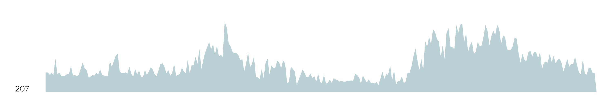
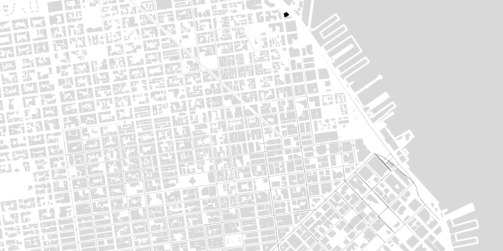
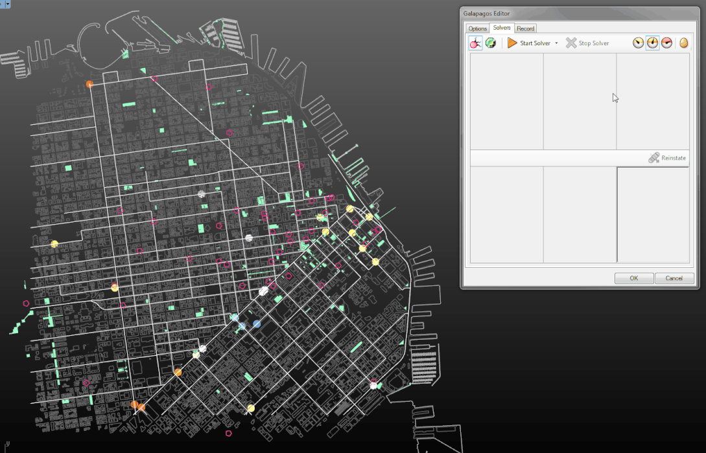

#Visualization @ MKThink

Brian Ho&ensp;//&ensp;works in progress&ensp;//&ensp;summer fellowship 2016
Note: independent research on VR; w/ Shahidah on DGG; w/ Jessie + RH1 on 4D. All will be presented next few weeks. instead thought to share a look behind the scenes: not only what, but why and how! hopefully get feedback for me, and  something sticks.

###the Tumblr

Find it online at [bit.ly/bho_viz](http://bit.ly/bho_viz)
Note: as an aside, content being kept in a running blog!

<h6>storage</h6>
###How can we use data?
Note: struggled to come up with how to structure. possibly because visualization doesn't really cover it: too passive, static, quantitative. I'm trying to work between the built environment - data - people. MKthink is a perfect lab: architects, data analysts, designers, developers, engineers, planners, strategists (in no order) under one roof. can I make things visual/manifest in a way that unites these disciplines?

<h6>map</h6>
###How can strategies and plans become reality?

<h6>business</h6>
###How can architects expand their scope of practice?

<h6>update</h6>
###How can we design with/for/against the next and the new?

##A presentation in three acts ...

<h3 class='fragment'>1. Interface</h3>

<h3 class='fragment'>2. Tool</h3>

<h3 class='fragment'>3. System</h3>

Note: as a framework, I've split this up into 3 parts. each will discuss both the ends and the means to that end.

<h6>devices</h6>
##1. Interface
Note: the front-end.

###User experience design for RoundhouseOne + 4daptive

An exercise in imagining an intuitive (as possible) "search" across non-spatial data.
Note: (adobe UXD)

###Adobe UXD

(N.B. it's currently free)

Note: (adobe UXD)

###Horizon chart

Trying to find ways to show lots of time-series data as a meaningful aggregate.
Note: (grasshoper)

###Horizon chart, closer

You can read both the details of individual series, as well as trends across nearby series.
Note: (grasshoper)

###Horizon chart, even closer

Preserves the resolution of information, while increasing vertical compression.

There's a [d3.js version](http://bl.ocks.org/mbostock/1483226) waiting to be made ...
Note: (grasshoper)

###Rhino + Grasshopper
</img>
&emsp;&emsp;&emsp;&emsp;&emsp;&emsp;&emsp;&emsp;&emsp;
</img>

An imperative/algorithmic visual programming language ... for geometry!

###What it looks like:

A mess, basically.

###What it looks like, closer:

Data in, data out. Simple! And extensible.

<h6>build</h6>
##2. Tool
Note: making things that help make other things.

###Interactive strategy tool

Maybe interaction can help a client understand trade-offs?
Note: 3D not so hot. A-frame?

###Interactive strategy tool

The color changes as the area approaches limits.

###Interactive strategy tool

3D, not so good.

###Space planning area tool

Drawing or editing polyline boundaries adjusts the chart.
Note: (flux)

###Space planning area tool

Colors are programmatic and can adjust to distinguish categories or sub-categories.
Note: (flux)

###Space planning area tool

Rhino is linked to Excel, so changes to spreadsheet labels or values adjust the chart ...
Note: (flux)

###Space planning area tool

... and vice versa.
Note: (flux)

###Flux
</img>

</img>

Puts all your data and geometry in the cloud. Free at [flux.io](flux.io)!

<h6>public</h6>
##3. System
Note: complete assemblies, broader interactions

###DepotGoGo map

Initial mapping of existing infrastructures.
Note: (galapagos, solving + learning)

###DepotGoGo map, closer

Layering information.
Note: (galapagos, solving + learning)

###GIS and APIs
</img>
&emsp;&emsp;&emsp;&emsp;&emsp;
</img>
&emsp;&emsp;&emsp;&emsp;&emsp;&emsp;&emsp;&emsp;&emsp;
</img>

Pulling GPS coordinates from the Google Places API into Grasshopper + importing GIS shapefiles from [SF OpenData](https://data.sfgov.org).

It's an alphabet soup!

Note: (galapagos, solving + learning)

###DepotGoGo location optimizing

Evolving a solution, in a full CAD environment.
Note: (galapagos, solving + learning)

###Galapagos

Survival of the fittest! Diagrams from [David Rutten](http://www.grasshopper3d.com/profiles/blogs/evolutionary-principles).
Note: (galapagos, solving + learning)

##Fin
Thanks for listening!
